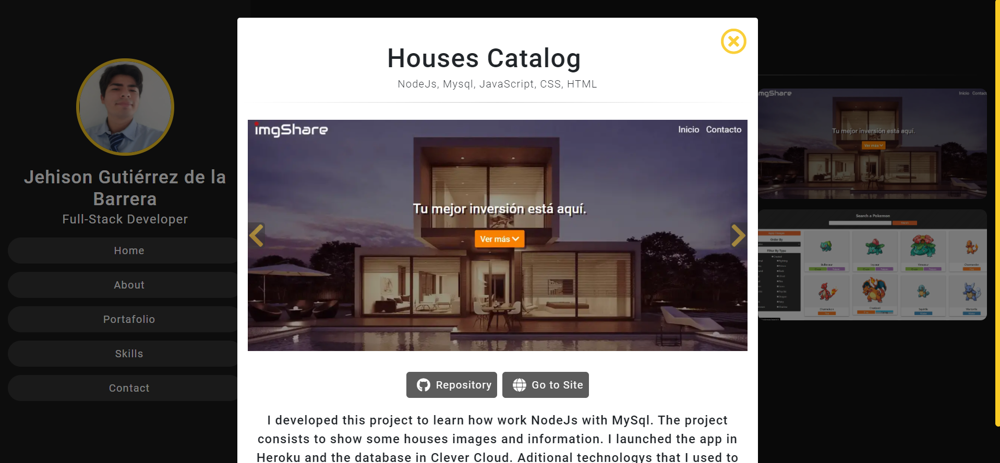

# 💼 **Portafolio - Jehison GB**

**My Portafolio Web Page**

**I Developed this project cause I needed one place to show all my projects and more info about me. I used a lot of my experience and knowledge to develop this project. I followed the best practices to have a clean code and a easy way to add new content. The page have a responsive design so you can navigate with any device**

## 💻 **Used Techonologies**

- **HTML5**
- **CSS3**
- **SASS**
- **JavaScript (ES6)**
- **Webpack**
- **Babel**
- **NodeJS**
- **ExpressJS**
- **NodeMailer**

## 💻 **Installation - click here to visit the site 👉 [My Portafolio](https://jehison98.github.io/JehisonGB-Portafolio/)** 👈

```
🔹 git clone https://github.com/jehison98/Jehison-Portafolio.git
🔹 npm install >> ./Jehison-Portafolio
🔹 npm start >> ./Jehison-Portafolio
```

## 💻 **imgiew**

<p>



</p>
<p>


</p>
